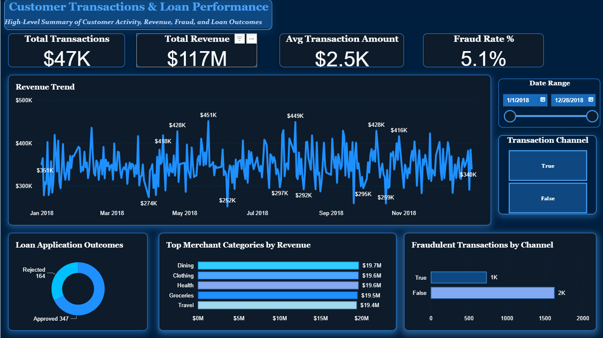
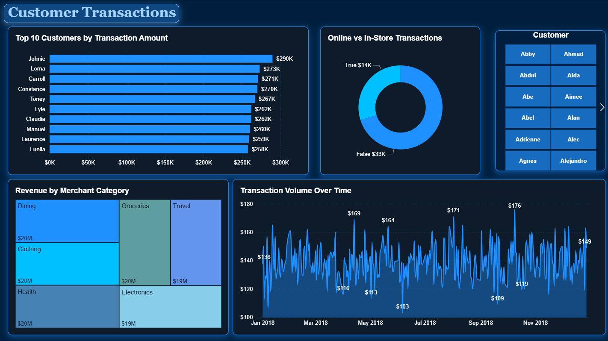
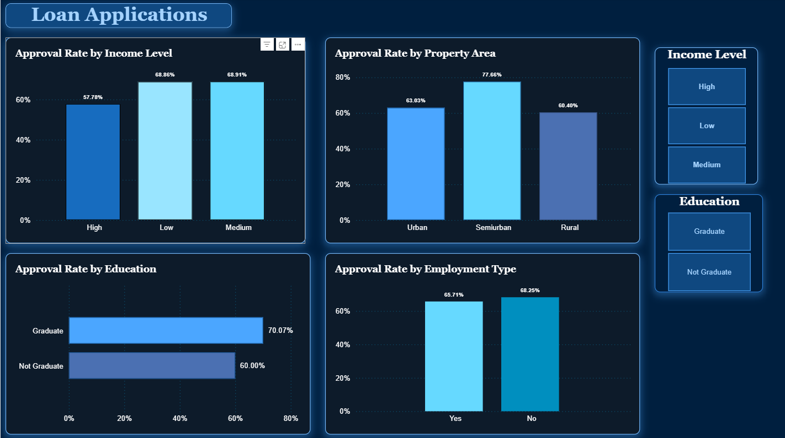

# Banking Corporation Data Analytics Capstone

## Project Overview

This project is an end-to-end data analytics capstone completed as part of the Per Scholas Data Analytics program. The project examines banking operations, financial performance, customer activity, spending patterns, and loan data using MySQL, Microsoft Excel, and Power BI.

The capstone progresses from relational database setup and validation to SQL-based analysis, spreadsheet-based financial analysis, and interactive business intelligence reporting.

## Tools & Technologies

- MySQL
- MySQL Workbench
- Microsoft Excel
- Power BI

## Skills Demonstrated

- Data Analysis
- Data Cleaning & Validation
- SQL Querying
- Relational Data Analysis
- JOINs
- GROUP BY & HAVING
- CASE Statements
- Subqueries
- Aggregate Functions
- Data Quality Investigation
- Financial & Operational Analysis
- Data Visualization
- Dashboard Development
- Business Problem Solving
- Data Interpretation

## Project Workflow

### Phase 1 — Database Construction & Validation

Configured and validated an instructor-provided relational database containing 12 interconnected tables covering customer, financial, and operational data.

This phase focused on successfully establishing the database environment, loading the provided data, confirming table structures and relationships, and ensuring the data was ready for analysis.

### Phase 2 — SQL Data Quality Investigation & Analysis

Used MySQL to explore the relational database, validate data relationships, and answer business-focused analytical questions.

Analysis included:

- Customer and transaction activity
- Merchant category spending
- Department expenditures
- Branch spending patterns
- Vendor activity
- Budget and cost center relationships
- Regional customer distribution
- Employee tenure
- Loan application outcomes
- Transaction segmentation

Additional exploratory queries were developed to investigate spending patterns, compare activity against meaningful baselines, identify high-activity cost centers, and explore loan approval behavior.

➡️ **[View SQL Analysis](sql/)**

### Phase 3 — Excel Financial & Operational Analysis

Used Microsoft Excel to perform financial and operational analysis on banking data, supporting the broader investigation of organizational performance and financial activity.

➡️ **[View Excel Analysis](excel/)**

### Phase 4 — Power BI Customer & Loan Analytics

Used Power BI to develop visual reporting focused on customer and loan analytics, transforming analytical results into an accessible business intelligence format.

➡️ **[View Power BI Analysis](power-bi/)**

## Power BI Dashboard

The Power BI portion of the capstone transforms customer, transaction, fraud, revenue, and loan data into interactive business intelligence reporting. The report contains three pages designed to move from high-level performance monitoring to more focused customer and loan analysis.

### Customer Transactions & Loan Performance



The executive overview combines customer transaction activity, revenue performance, fraud indicators, merchant-category performance, and loan outcomes in a single report.

Key performance indicators include total transactions, total revenue, average transaction amount, and fraud rate. Additional visualizations examine revenue trends over time, loan application outcomes, top merchant categories by revenue, and fraudulent transactions by channel.

### Customer Transaction Analysis



This report provides a deeper view of customer transaction behavior. It examines top customers by transaction amount, online versus in-store transactions, revenue by merchant category, and transaction activity over time.

Interactive customer filtering allows individual customers to be selected for more focused analysis.

### Loan Application Analysis



This report examines loan approval patterns across several applicant and property characteristics.

Approval rates are compared by income level, property area, education, and employment type. Interactive filters allow the report to be further explored by income and education segments.

## Selected SQL Analysis

The SQL portion of the project demonstrates the use of relational queries to move beyond basic data retrieval and investigate business questions across multiple datasets.

Techniques used include:

- INNER and LEFT JOINs
- GROUP BY and HAVING
- SUM, COUNT, and AVG aggregations
- CASE statements
- Subqueries
- Conditional aggregation
- Date conversion and calculations
- Text manipulation
- Multi-table relationship analysis

Examples of questions explored include:

- Which merchant categories generate the highest transaction volume and spending?
- Which departments account for the most expenditures?
- Which vendors have significant financial activity?
- How does customer distribution vary by region?
- Which branches have above-average expenditures?
- How do loan approval outcomes vary across applicant characteristics?
- Which cost centers show the highest levels of spending activity?

## Repository Structure

```text
banking-corporation-data-analytics-capstone/
│
├── README.md
├── sql/
│   └── SQL analysis files
├── excel/
│   └── Excel financial and operational analysis
└── power-bi/
    └── Power BI customer and loan analytics
```

## About This Project

This capstone was completed as part of the **Per Scholas Data Analytics** program and was designed to apply analytical concepts across multiple tools and stages of the data analysis process.

The project demonstrates my ability to work with relational data, investigate business questions, identify patterns and data limitations, document analytical reasoning, and communicate findings through queries, spreadsheets, and business intelligence reporting.
